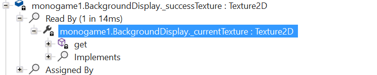

Flare-on 10 writeups. You can read writeups for challenge details; I tried to minimize the content and focus on which tricks/mindsets helped me solve them fast. I didn't know there was rickroll midi file in one of the challenges. Oh my god.

## #1. X

Let's start with the first challenge: X.


Familiar filenames like CSharp there, so it seems like a .NET application, so let's use [ILSpy](https://github.com/icsharpcode/ILSpy). Usually, .exe is just a wrapper for launching .dll in .NET apps, so let's just go to X.dll.


Oh, "_successTexture"? Let's see which part of program uses it; We can click "Analyze" menu from ILSpy which shows a cross-reference to it.



Let's see _currentTexture.

```c#
private Texture2D _currentTexture {
...
		if (_state == BackgroundStates.Success)
			return _successTexture;
...
}
```

So, _currentTexture shows it if the "state" is success. Who sets the state? Click "Analyze" on _state again.


`Game1._lockButton_Click`?


Yey, `glorified_captcha@flare-on.com`; **Analyze** menu was quite useful here.
