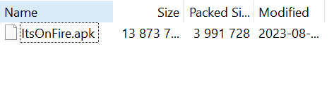
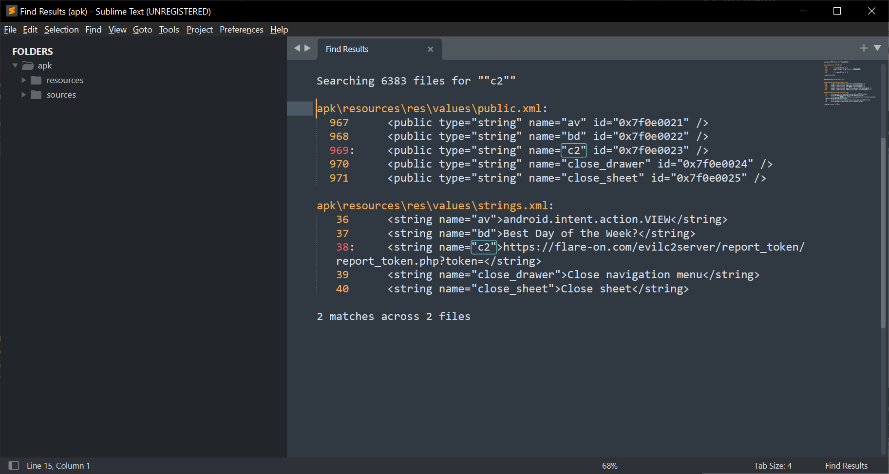
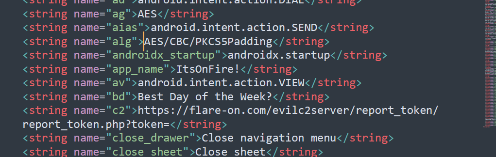

## #2. ItsOnFire



.apk extension is usually used for Android apps. We can use [jadx](https://github.com/skylot/jadx).


The class names seems minimized (or obfuscated). We can see which class are launched first when app is launched, by checking the AndroidManifest.xml.


By search `android.intent.action.MAIN` we can see the name of the main activity: **`MalwareInvadersActivity`**. Let's go there.


It says we need to "destroy" the malware invaders in time. That's all, so let's see other classes... Oh, "PostByWeb"? Suspicious. Why a game posts something to websites?


It was just a wrapper around HTTP APIs. Let's see who uses PostByWeb, by pressing key X on the class name.


It's MessageWorker.onNewToken. I pressed Enter.


It uses "R.string.c2"; "R" is a reference to android resources. Since resources file are spreaded over multiple XML files in the Resources folder above, let's extract all the source code and resources, by clicking File > Save All. And let's search "c2".



So "c2" points a string `https://flare-on.com/evilc2server/report_token/report_token.php?token=`. But the server seemed down. Let's see what uses onNewToken... Wait.



What is "alg" there? Let's search `R.string.alg`.


What? It seems like it loads a resource with id `i2`. What calls this function? By clicking `X` a few times, I could get this flow.

```java
    public final Intent f(@NotNull Context context, int i2) {
        Uri uriForFile = FileProvider.getUriForFile(context, Intrinsics.stringPlus(context.getApplicationContext().getPackageName(), context.getString(R.string.prdr)), c(i2, context));
...
    }
```

... which is called by (Watch the variable `i3` below)

```java
        int i3;
...
...
            if (Intrinsics.areEqual(param, context.getString(R.string.t1))) {
                bVar = b.f360a;
                i3 = R.raw.ps;
            } else if (Intrinsics.areEqual(param, context.getString(R.string.w1))) {
                bVar = b.f360a;
                i3 = R.raw.iv;
            }
...
            return PendingIntent.getActivity(context, 100, bVar.f(context, i3), 201326592);

```

So it seems like there's some resources named "ps" and "iv". `raw` resources are in `resources/raw` folder.


While named `iv.png`, they are not PNG files. It seems like it's feeded into the decryption routine `c` above, which uses AES-CBC encryption with key from `d(context)` and the IV `"abcdefghijklmnop"`.


So `bytes` seems like `c2[4:10]+w1[2:5]` which is `'s://flare-dnesd'`. What is `a(bytes)` there?

```java
    private final long a(byte[] bArr) {
        CRC32 crc32 = new CRC32();
        crc32.update(bArr);
        return crc32.getValue();
    }
```

So `d(context)` returns `str(crc32(c2[4:10]+w1[2:5])) * 2`. Let's try to decrypt `iv.png` using the knowledge above. Here's the python code to decrypt `iv.png`.

```python
import zlib
c2=b'https://flare-on.com/evilc2server/report_token/report_token.php?token='
w1=b'wednesday'
key = (str(zlib.crc32(c2[4:10]+w1[2:5])) * 2)[:16].encode()
iv = b"abcdefghijklmnop"

# pip install pycryptodome
from Crypto.Cipher import AES
aes = AES.new(key, AES.MODE_CBC, iv)
data=aes.decrypt(open("iv.png", "rb").read())
print(data[:8])
```

Which shows a magic bytes of PNG files:

```
>>> print(data[:8])
b'\x89PNG\r\n\x1a\n'
```

So let's save it to `iv_.png`.
Java truncates the AES key when the key is larger than 16 bytes, hence the `[:16]` above.


Cool! There's the flag for the challenge 2.