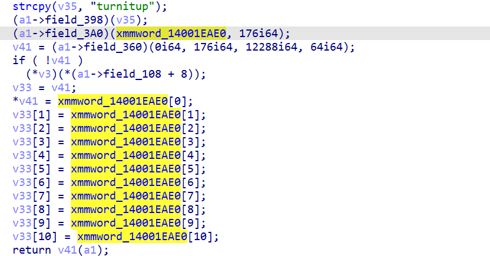
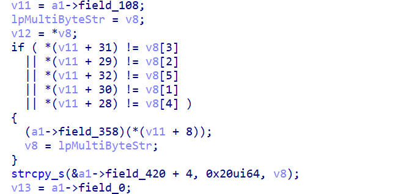

## #3. mypassion

.exe written with MSVC C/C++ is given. Let's open it with IDA Pro.


`Destination` is a 1200 bytes stack buffer. Let's just [define a struct](https://hex-rays.com/blog/igor-tip-of-the-week-12-creating-structures-with-known-size/) with 1200 / 8 pointers.


Much cleaner. Let's see the inner function.



Recent versions of IDA Pro supports `Ctrl+Alt+X` [which shows global cross-references](https://hex-rays.com/blog/igors-tip-of-the-week-18-decompiler-and-global-cross-references/) on struct fields. I used it throughout the challenge.
Pressing Ctrl+Alt+X, we'll know that `field_360` is VirtualAlloc, which means it'll execute shellcode.
At this point, we can dump the shellcode by launching debugger with a breakpoint at `v41(a1)`.

But due to laziness and for fun, I went to `14001EAE0` and press C to disassemble the code...


This seems obfuscated. Re-checking the code above, `14001EAE0` is passed to `field_3A0`, which is `sub_140002D20`.


Seems like a trivial decryption; what is `hKey`? Again, we can use debugging but let's press `X` on `hKey` like it's a real malware.

```c
__int64 __fastcall sub_140002C00(BYTE *pbData)
{
...
  if ( !CryptCreateHash(hProv, 0x800Cu, 0i64, 0, &phHash) )
    goto LABEL_12;
  v2 = -1i64;
  do
    ++v2;
  while ( pbData[v2] );
  if ( !CryptHashData(phHash, pbData, v2, 0)
    || !CryptDeriveKey(hProv, 0x6610u, phHash, 0, &hKey)
    || (pbDataa = 1, (v3 = CryptSetKeyParam(hKey, 4u, &pbDataa, 0)) == 0) )
  {
...
  }
...
}
```

Pressing `M` on `0x880C` and `0x6610` we can know that it's AES-256 key derived after SHA-256 hash. Pressing `X` on the function itself reveals that it's `field_398`. From the screenshot above, we can know that the `pbData` is `"turnitup"`. Now we can decrypt the obfuscated code using SHA-256 and AES.


Let's use IDAPython to decrypt the code. When things go wrong, we can just press Ctrl+Z to revert the result!

```python
from Crypto.Cipher import AES
from hashlib import sha256
aes = AES.new(sha256(b'turnitup').digest(), AES.MODE_CBC, b"capture_the_flag")
addr = 0x14001EAE0
idaapi.patch_bytes(addr, aes.decrypt(idaapi.get_bytes(addr, 176)))
```

We got the shellcode! Let's decompile it. This part is "Stage 2" in [the official writeup](https://services.google.com/fh/files/misc/3-mypassion-flareon10.pdf).


`field_358:ExitProcess & field_388:strnlen`, so it checks `v6` from `field_380()` to be the length of `v4`. `field_380:strtol` so it expects `v2` be a string like `5abcde`. Mulitple solutions here, so it's not a flag itself (Hopefully!).

By further analysis we know that `field_390()` is `input.split("/")[a2]`. `field_368:free`, so only `field_3B0` remains (`sub_1400018B0`). That was stage 3, and I'll summarize it here:

Checking 5 bytes from our input:



Some other checks:


This function ends with another inner function.


This challenge has many stages like this. Stage 5 needs some data populated by Stage 2 & 3, some constraints on Stage 2 affects Stage 5, ... Ctrl+Alt+X and debugger helps a lot e.g., discover the connections using global cross references, and use debugger when something is uncertain or forgotten.

Another trick is; if there are many stages, just go into the innerest function - because usually that function will be closest to the flag-printing, or "Correct"-printing function in CTF, so we can know what we should do eventually to get the flag. This is the inner-est function.

```c
  (a1->field_398)(key, v10, v6, i);             // generate key
  v11 = &unk_140049420;
  (a1->field_3A0)(&unk_140049420, 960i64);      // and decrypt
  v17 = (a1->field_360)(0i64, 960i64, 12288i64, 64i64);// VirtualAlloc
  if ( !v17 )
    (a1->field_358)(*(a1->field_108 + 8));

...

  *v12 = *v11;
  v12[1] = v11[1];
  v12[2] = v11[2];
  v12[3] = v11[3];
  return (v17)(a1);                             // then execute
```

This seems similar to the first inner function except we don't know the key this time.


This is the start of the function; `key` is 7th part of the input separated by `/`. `BYTE2(v16) = '5'` so it's `??5????`. To put the long story short, this is the payload I used for the input.

```
0,w__R@brUc3E/1337pr.ost/20jinmo123/?pizza//Ainmo123jiAme123/RUECKWAERTSINGENIEURWESEN/?b5c
```

The official writeup also has the final payload:

```
0A#P_R@brUc3E/1337pr.ost/20AAAAAAAA/<day_character>pizza/AMu$E`0R.fAZe/YPXEKCZXYI
GMNOXNMXPYCXGXN/ob5cUr3/
```

p.s. for Stage 5:

Stage 5 of this challenge decodes a shellcode using input as a key; there was few key that makes it execute successfully. Some keys breaks opcodes, some are used as offset of [PEB](https://learn.microsoft.com/en-us/windows/win32/api/winternl/ns-winternl-peb), etc.

Actually, from the start I guessed it to be a custom implementation of GetProcAddress, since this pattern appeared a lot in CTFs. Windows exploits tend to resolve a lot of APIs instead of directly using syscalls, since [the system call numbers changes a lot](https://j00ru.vexillium.org/syscalls/nt/64/).

Also, by just ignoring the broken bytes and looking the code after that, we can also find out the whole structure e.g., it tries to "find" something using a loop, etc. It made me to be more certain about the guess.